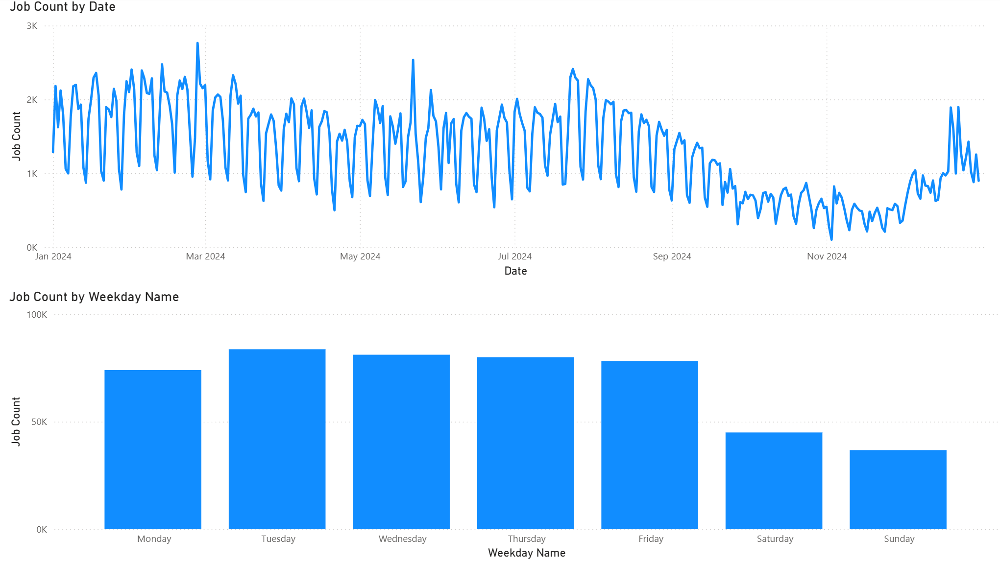

# 📊 Tech Job Market Analysis Dashboard
## 🚀 Project Overview
This project features a series of Power BI dashboards designed to provide data-driven insights into the technology recruitment landscape. By analyzing over 478,000 job postings, this tool helps identify seasonal hiring trends, high-paying roles, and the most lucrative technical skills in the current market.

## 📈 Key Insights & Features
### 📅 Hiring Trends & Seasonality
Job Count by Date: Tracks the daily volume of job postings throughout the year, revealing cyclical patterns in hiring.

Weekday Analysis: Breaks down postings by day of the week, showing that recruitment activity peaks during mid-week (Tuesday/Wednesday) and significantly drops over the weekend.

## 💰 Salary Benchmarking
Top Paying Roles: A comparative analysis of median yearly salaries across various job titles. Specialized roles like Senior Data Scientist and Machine Learning Engineer lead the pack with salaries exceeding $150k.

Skill-Based Compensation: Highlights the "premium" skills that command the highest pay, featuring technologies like Unreal Engine, Golang, and Haskell.

## 🔍 Market Demand & Volume
Role Distribution: A detailed breakdown of the total job count per title.

The Big Players: Data shows that Data Engineer and Data Analyst are among the most frequently posted positions, indicating high market demand for data-centric talent.

## 🛠️ Data Architecture
The project utilizes a structured Star Schema within Power BI to ensure efficient filtering and performance. The data model includes:

Fact Table: job_postings_fact containing core metrics.

Dimension Tables: date_dim, company_dim, skills_dim, and job_title_dim for granular slicing and dicing of data.

## 🎨 Visualizations Included
Line Charts: For time-series analysis of job postings.

Bar Charts: For comparing median salaries by title and specific technical skills.

Column Charts: To visualize weekly hiring distributions.

Data Matrix: For precise numerical breakdowns of job counts.

## 🖥️ Technologies Used
Power BI Desktop: For data modeling and visualization.

DAX (Data Analysis Expressions): Used to calculate median salaries and custom aggregations.

Power Query: For data cleaning and transformation (ETL).
